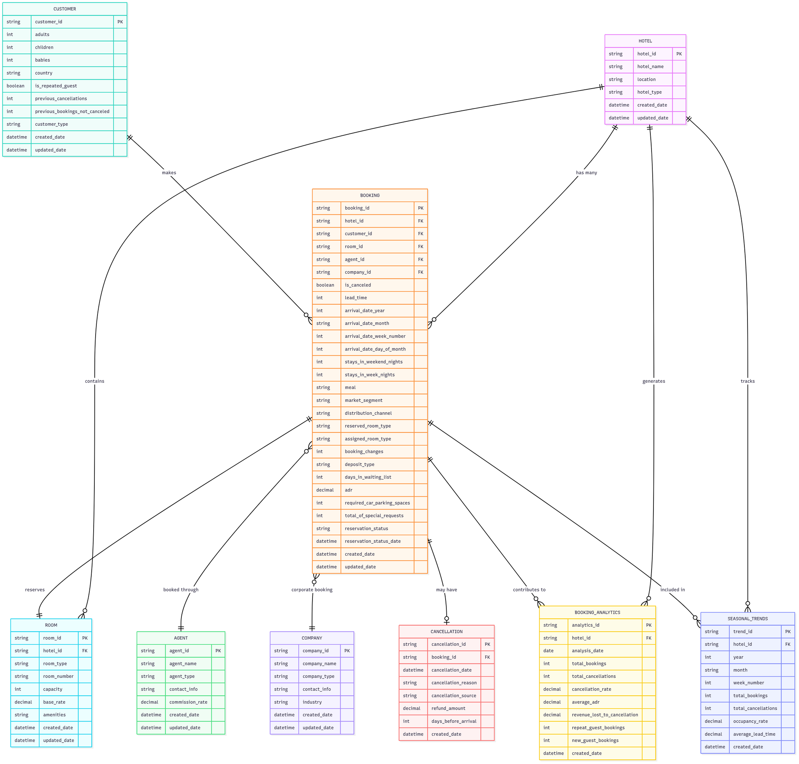

<h1>Tourism-Department</h1>
<h2>Hotel Booking Analytics for Cancellation Trends and Most Booked Hotel Insights</h2>

 
<h2>Executive Summary</h2>

The Hotel Booking Analytics for Cancellation Trends and Most Booked Hotel Insights project aims to implement a centralized, cloud-based data warehouse designed specifically for the hospitality sector. By integrating booking data from multiple channels and locations, the system will provide hotel management with powerful analytical tools to track booking patterns, identify the most frequently booked hotels, and uncover the primary causes of cancellations. This data-driven approach will enable management to make informed strategic decisions, optimize pricing and promotions, improve occupancy rates, and reduce financial losses from cancellations. The project’s ultimate goal is to transform raw booking data into actionable insights that drive customer retention, revenue growth, and operational efficiency across the hotel network.

   
<h2>Project Purpose</h2>

To build a cloud-based data warehouse system that consolidates and analyzes hotel booking data from multiple platforms and locations, enabling management to monitor cancellation patterns, identify top-performing hotels, and develop strategies to enhance customer retention. By leveraging analytics, the system will provide actionable insights into booking behavior, seasonal trends, and revenue impact, allowing hotel operators to optimize pricing models, improve occupancy rates, and reduce losses from cancellations.

<h2>Project Goals and Objectives</h2>

Achieve measurable improvements in hotel performance, including a 15% reduction in booking cancellations, a 10% increase in occupancy rates for underperforming hotels, and a 20% improvement in the accuracy of revenue forecasting. The goal is to utilize advanced analytics to enhance decision-making processes in hotel management, optimize promotional strategies, and strengthen customer loyalty programs. By implementing a centralized data warehouse and real-time reporting tools, the project seeks to improve operational efficiency, maximize revenue potential, and provide hotel executives with actionable insights to sustain long-term business growth.
  

 
 

<h2>Entity Relationship Diagram</h2>
  

 
  <picture>
   
</picture>
 

<h2>Star Schema Diagram</h2>
  

 
<picture>
   
</picture>
